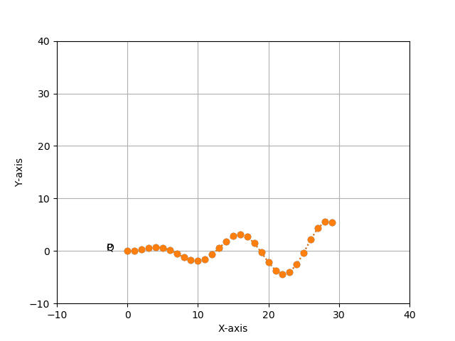

# Iterative-closest-points-ICP

This is the part of Master degree intergration project. The main purpose is to use the iterative closest points (ICP) based on Gauss-Newton method optimization to minimize the difference between two points clouds. It is works by keep one point cloud as the reference or target (fixed), while try to transform the other (other source) in order to match the reference.

## Dependency
To use matplotlib for plotting use the instrustion in this github https://github.com/lava/matplotlib-cpp

## Requirements
- Matplotlibcpp
- Egen
## To build this repository 
1. Clone the respository:
```bash
https://github.com/panhachet/Iterative-closest-points-ICP-.git
```
2. Go into the respository:
```bash
cd Iterative-closest-points-ICP-/ICP_CPP
```
3. Make a build folder
```bash
make build
```
4. Go into build folder
```bash
cd build 
```
5. Make
```bash
cmake ..
make
```
## Results
1. Before apply icp
   
   
2. After apply icp
   
   

## Reference

- https://github.com/lava/matplotlib-cpp
- https://github.com/niosus/notebooks/blob/master/icp.ipynb
- https://github.com/jlblancoc/nanoflann
