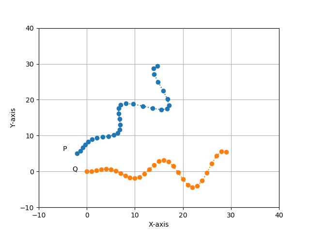

# Iterative-closest-points-ICP

This is the part of Master degree intergration project.

## Dependency
To use matplotlib for plotting use the instrustion in this github https://github.com/lava/matplotlib-cpp

## Requirements
- Matplotlibcpp
- Egen
## To build this repository 
1. Clone the respository:
```bash
https://github.com/panhachet/Iterative-closest-points-ICP-.git
```
2. Go into the respository:
```bash
cd Iterative-closest-points-ICP-/ICP_CPP
```
3. Make a build folder
```bash
make build
```
4. Go into build folder
```bash
cd build 
```
5. Make
```bash
cmake ..
make
```
## Results
1. Before apply icp
   
2. After apply icp
   
